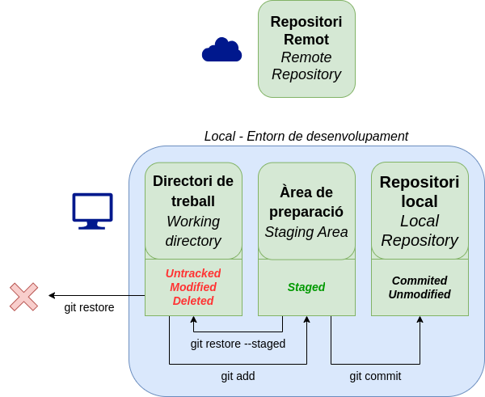
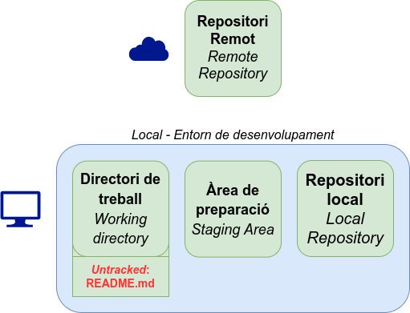
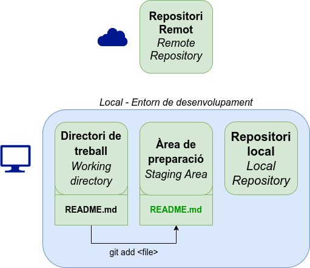
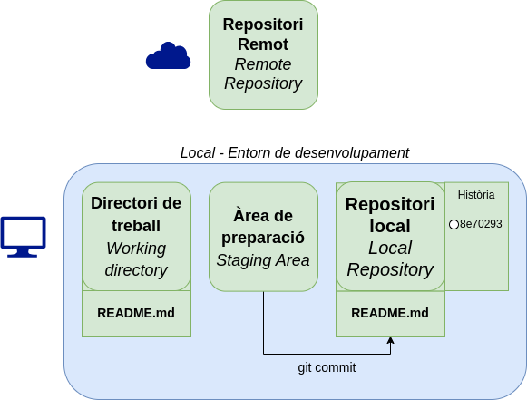

## Què és Git?
Git és __un sistema de control de versions lliure i distribuït__ dissenyat per gestionar xicotets i grans projectes
amb rapidesa i eficiència. L'objectiu principal de Git és controlar i gestionar els canvis realitzats
en una enorme quantitat de fitxers d'una manera fàcil i eficient.

Git va ser dissenyat en 2005 per Linus Torvalds, creador del kernel del sistema operatiu Linux, i des d'aleshores,
s'ha convertit en una eina fonamental i imprescindible en la gestió de codi font en projectes col·laboratius.

Git està basat en __repositoris__, que s'inicialitzen en un directori concret i contenen tota la informació
dels canvis realitzats en tot l'arbre de directoris i fitxers a partir d'aquest directori.

Els principals objectius i característiques de Git són:

- __Control de versions__: Git realitza un seguiment de les modificacions als arxius al llarg del temps,
    la qual cosa permet als desenvolupadors vore i recuperar versions anteriors del seu codi.
    Aquesta característica és essencial per a treballar en equips i per a solucionar problemes o errors.
- __Distribuït__: Cada còpia d'un repositori Git conté tot l'historial de canvis i pot operar de manera independent.
    Això facilita el treball fora de línia i la col·laboració en equips distribuïts.
- __Branca i fusió__: Git facilita la creació de branques (_branching_) per a desenvolupar característiques
    o solucionar problemes sense afectar la branca principal.
    Després, pots fusionar (_merge_) les branques de nou en la branca principal quan estiguen a punt.
- __Gestió de conflictes__: Git ofereix eines per a gestionar conflictes en cas que dues o més persones hagen realitzat
    canvis en la mateixa part del codi.
    Els desenvolupadors poden resoldre aquests conflictes manualment.
- __Col·laboració__: Git facilita la col·laboració en projectes de codi obert o en equips,
    ja que permet a múltiples persones treballar en el mateix projecte de manera eficient.
    Plataformes com GitHub, GitLab i Bitbucket s'utilitzen comunament per a allotjar repositoris Git en línia i col·laborar en projectes.
- __Codi obert i gratuït__: Git és de codi obert i gratuït, la qual cosa significa que qualsevol pot utilitzar-lo sense cost i contribuir al desenvolupament de l'eina.


## Per què la terminal?
En aquest material, utilitzarem la terminal per a interactuar amb Git, però això no significa que siga l'única manera de fer-ho.
De fet, pràcticament tots els entorns de desenvolupament moderns tenen integració amb Git, la qual cosa permet realitzar
les mateixes operacions que proporciona la terminal, però de manera més visual i intuïtiva.

No obstant això, és important conéixer com funcionen les comandes de Git en la terminal, per diferents raons:

- __Portabilitat__: La terminal és un entorn comú en tots els sistemes operatius i en qualsevol entorn de desenvolupament.
- __Flexibilitat__: La terminal permet realitzar operacions més avançades i personalitzades que les interfícies gràfiques.
- __Comprensió__: Permet entendre com funcionen les comandes de Git i els processos que realitza en el sistema.


## Inicialització d'un repositori (`git init`)

Per a començar a utilitzar Git en un projecte, primer cal inicialitzar un repositori en un directori concret.
```bash
git init [<directory>]
```

- `directory`: Directori on es vol inicialitzar el repositori. Si no s'especifica, s'utilitza el directori actual.

Aquesta comanda crea un directori ocult anomenat `.git`
que conté tota la informació relativa al __Repositori Local__.

!!! docs
    Documentació oficial de `git init`: https://git-scm.com/docs/git-init


??? example "Exemple: Inicialització d'un repositori"
    ```shellconsole
    jpuigcerver@fp:~ $ mkdir git_introduccio
    jpuigcerver@fp:~ $ cd git_introduccio
    jpuigcerver@fp:~/git_introduccio $ ls -a # (1)!
    .  ..
    jpuigcerver@fp:~/git_introduccio $ git init
    hint: Using 'master' as the name for the initial branch. This default branch name
    hint: is subject to change. To configure the initial branch name to use in all
    hint: of your new repositoris, which will suppress this warning, call:
    hint:
    hint: git config --global init.dafaultBranch <name>
    hint:
    hint: Names commonly chosen instead of 'master' are 'main', 'trunk' and
    hint: 'development'. The just-created branch can be renamed via this command:
    hint:
    hint: git branch -m <name>
    Initialized empty Git repository in /home/jpuigcerver/git_introduccio/.git/
    jpuigcerver@fp:~/git_introduccio (master) $ git branch -m main
    jpuigcerver@fp:~/git_introduccio (main) $ ls -a # (2)!
    .  ..  .git/
    jpuigcerver@fp:~/git_introduccio (main) $ git status
    On branch main

    No commits yet

    Nothing to commit (create/copy files and use "git add" to track)
    ```

    1. L'opció `-a` mostra tots els fitxers, inclosos els ocults que comencen amb un punt.
    2. S'ha creat el directori ocult `.git` que conté tota la informació del repositori.

    L'ordre `git status` ens mostra l'estat actual del nostre repositori.
    Podem observar que estem en la branca `main` i que de moment no s'ha realitzat cap canvi.

    !!! note
        S'ha canviat el nom de la branca principal de `master` a `main` per a seguir les recomanacions de la comunitat de desenvolupament.

        Vegeu: [Regarding Git and Branch Naming](https://sfconservancy.org/news/2020/jun/23/gitbranchname/)

### Eliminar un repositori
Per a eliminar un repositori de Git, simplement cal eliminar el directori ocult `.git`.

```bash
rm -rf .git
```

- `-r`: Opció per a eliminar de manera recursiva.
- `-f`: Opció per a forçar l'eliminació sense confirmació dels elements protegits contra escriptura.

!!! danger
    Sigues extremadament cautelós amb l'ús de la comanda `rm -rf`,
    ja que elimina tots els fitxers, inclosos aquells protegits contra escriptura.

??? example "Exemple: Eliminar un repositori"
    ```shellconsole
    jpuigcerver@fp:~/git_introduccio (main) $ ls -a
    .  ..  .git
    jpuigcerver@fp:~/git_introduccio (main) $ rm -rf .git
    jpuigcerver@fp:~/git_introduccio $ git status
    fatal: not a git repository (or any of the parent directories): .git
    ```

## Estructura d'un repositori de Git
En aquesta introducció, ens centrarem en com funcionen els repositoris de Git d'una manera __local__,
on encara no haurem connectat cap repositori __remot__.

Abans que res, hem de conéixer l'estructura d'un repositori de Git.


/// figure-caption
Components d'un repositori de Git.
///

En la figura anterior podem observar el que es coneix com __Entorn de desenvolupament__ o __*Development Environment*__,
Aquesta part està present __localment__ en el teu dispositiu on realitzaràs els canvis i desenvolupament del teu projecte.

D'una altra banda, està el __Repositori Remot__, que normalment s'allotja a un servidor accessible per tots els
desenvolupadors.

Dins de l'_Entorn de desenvolupament_ trobem els següents components:

- __Directori de treball__ o __*Working directory*__: Directori o carpeta del sistema on s'emmagatzema _localment_
    els continguts del repositori.
- __Àrea de preparació__ o __*Staging Area*__: Àrea que s'utilitza per indicar quins canvis volen ser confirmats.
- __Repositori local__ o __Local repository__: Repositori emmagatzemat _localment_ on es queden registrats totes les versions
    i canvis realitzats en els fitxers del repositori, així com la informació de les branques i les etiquetes.


## Flux de treball

Quan treballes amb un projecte de Git, els canvis es realitzen sobre el __Directori de treball__.
Aquests canvis poden ser:

- __Crear un nou fitxer.__ El nou fitxer comença en l'estat __Untracked__, és a dir, no està sotmès a seguiment per Git.
- __Modificar un fitxer amb seguiment.__ El fitxer modificat es trobarà en l'estat __Modified__.
- __Eliminar un fitxer amb seguiment.__ El fitxer eliminat es trobarà en l'estat __Deleted__.

Si executem l'ordre `git status`, ens mostrarà l'estat actual dels fitxers amb els tres estats anteriors de color roig.


Aquests canvis no formen part del repositori. Abans, cal afegir-los a l'__Àrea de preparació__ amb la comanda `git add`,
que canviarà l'estat dels fitxers __Staged__ (mostrat en color verd amb `git status`).

Per últim, tots els canvis de l'__Àrea de preparació__ es poden confirmar i fer efectius en el __Repositori local__ amb la comanda `git commit`.


/// figure-caption
    attrs: { id: "figure-flux-treball" }
Flux de treball en un repositori de Git.
///

!!! info
    La comanda `git restore` es presenta a l'apartat [Descartar canvis](#descartar-canvis-git-restore).

!!! docs
    Documentació oficial de:

    - `git status`: https://git-scm.com/docs/git-status
    - `git add`: https://git-scm.com/docs/git-add
    - `git commit`: https://git-scm.com/docs/git-commit


## Afegir fitxers a l'Àrea de Preparació (`git add`)
Afegim el primer fitxer `README.md` al nostre repositori.

!!! info
    És recomanable crear un fitxer `README.md` en tots els projectes per a descriure el seu propòsit,
    com s'utilitza i qualsevol altra informació rellevant.

```shellconsole
jpuigcerver@fp:~/git_introduccio (main) $ echo "# 01 - Introducció a Git" > README.md
jpuigcerver@fp:~/git_introduccio (main) $ echo "Estem aprenent a utilitzar Git!" >> README.md
jpuigcerver@fp:~/git_introduccio (main) $ cat README.md
# 01 - Introducció a Git
Estem aprenent a utilitzar Git!
jpuigcerver@fp:~/git_introduccio (main) $ git status
On branch main

No commits yet

Untracked files:
  (use "git add <file>..." to include in what will be committed)
        README.md

Nothing added to commit but untracked files present (use "git add" to track)
```

S'ha creat el fitxer `README.md` i s'ha afegit el seu contingut. Aquest fitxer resideix en el __Directori de treball__.

La comanda `git status` ens mostra que no s'està realitzant cap seguiment del fitxer `README.md`,
que es troba en l'estat __Untracked__.


/// figure-caption
Fitxer sense seguiment (untracked).
///

Per afegir els canvis al nostre repositori, el següent pas és afegir
els canvis a l'_Àrea de Preparació_ amb l'ordre `git add`.
Aquesta comanda permet especificar quins canvis es desitja afegir.

!!! info
    ```bash
    git add <path>
    ```

    - `path`: Ruta del fitxer o directori que es vol afegir a l'_Àrea de Preparació_.


```shellconsole
jpuigcerver@FP:~/git_introduccio (main) $ git add README.md
jpuigcerver@FP:~/git_introduccio (main) $ git status
On branch main

No commits yet

Changes to be committed:
  (use "git rm --cached <file>..." to unstage)
        new file:   README.md
```

Vegem com el fitxer `README.md` ha passat a l'estat __Staged__ i està preparat per a ser confirmat.


/// figure-caption
Fitxer a l'Àrea de Preparació (staged).
///


## Confirmar canvis (`git commit`)

Una vegada afegits tots els canvis a l'_Àrea de Preparació_, ja podem __confirmar-los__
mitjançant l'ordre `git commit`.

```bash
git commit [-a] [-m "<message>"]
```

- `-a`: Opcional. Afegeix tots els fitxers modificats i eliminats a l'_Àrea de Preparació_ (sense necessitat de `git add`).
- `-m "<message>"`: Opcional. Missatge que descriu el canvi realitzat en el `commit`.

!!! warning annotate
    Si no s'especifica el missatge amb `-m`, s'obrirà l'editor per defecte(1) per a introduir el missatge del `commit`.

1. `ViM` per defecte. Pot ser configurat: 
    ```bash
    git config --global core.editor <editor>
    ```


/// figure-caption
Estat del repositori de Git abans de fer un `commit`.
///

Aquesta ordre crea un nou `commit`, que és una instantània de l'estat actual dels fitxers
del repositori i que conté tota la informació relativa als canvis realitzats.

Cadascun dels `commit` conté la següent informació:

- __Autor__: Persona que ha realitzat el `commit`.
- __Correu electrònic__: Correu electrònic de l'autor.
- __Data__: Data i hora en què s'ha realitzat el `commit`.
- __Missatge__: Descripció dels canvis realitzats en el `commit`.
- __Identificador o `hash`__: Codi únic generat automàticament que identifica el `commit`.
- __Canvis__: Llista de fitxers modificats, afegits o eliminats en el `commit` i els canvis realitzats en ells __respecte de la versió anterior__.

Per tant, abans de realitzar un `commit`, és necessari configurar el nom i el correu electrònic de l'autor.

```bash
git config --global user.name <name>
git config --global user.email <email>
```

```shellconsole
jpuigcerver@FP:~/git_introduccio (main) $ git config --global user.name "{{ config.site_author }}"
jpuigcerver@FP:~/git_introduccio (main) $ git config --global user.email "{{ config.site_email }}"
```

Amb aquesta informació configurada, ja podem realitzar el nostre primer `commit`.

```shellconsole
jpuigcerver@FP:~/git_introduccio (main) $ git status
On branch main

No commits yet

Changes to be committed:
  (use "git rm --cached <file>..." to unstage)
        new file:   README.md
jpuigcerver@FP:~/git_introduccio (main) $ git commit -m "Added README.md"
[main (root-commit) 8e70293] Added README.md
 1 file changed, 2 insertions(+)
 create mode 100644 README.md
jpuigcerver@FP:~/git_introduccio (main) $ git status
On branch main

nothing to commit, working tree clean
```

Vegem que l'estat del nostre repositori ha canviat i ja no hi ha canvis pendents de confirmar.
A més, s'ha creat el primer `commit` amb el missatge `Added README.md` i identificador `8e70293`.


/// figure-caption
Estat del repositori de Git després de fer un `commit`.
///

Podem consultar la informació del nou `commit` amb l'ordre `git show`.

```shellconsole
jpuigcerver@FP:~/git_introduccio (main) $ git show 8e70293
commit 8e702933d5dbec9ee71100a1599ae4491085e1aa (HEAD -> main)
Author: {{ config.site_author }} <{{ config.site_email }}>
Date:   Fri Oct 13 16:06:59 2023 +0200

    Added README.md

diff --git a/README.md b/README.md
new file mode 100644
index 0000000..6d747b3
--- /dev/null
+++ b/README.md
@@ -0,0 +1,2 @@
+# 01 - Introducció a Git
+Estem aprenent a utilitzar Git!
```

## Diferències entre versions (`git diff`)
Una ferramenta molt útil de Git és `git diff`, que permet comparar les diferències entre els canvis realitzats
en el __Directori de treball__ o __l'Àrea de Preparació__ respecte del __Repositori local__.

La sintaxi amb les opcions bàsiques es:
```bash
git diff [--staged] [<path>]
```

- `--staged`: Opcional. Mostra les diferències entre __l'Àrea de Preparació__ i el __Repositori local__.
    Si no s'indica, es compararan les diferències entre el __Directori de treball__ i el __Repositori local__.
- `<path>`: Opcional. Fitxer o directori sobre el qual es vol comparar les diferències.
    Si no s'indica, es compararan totes les diferències.

!!! docs
    Documentació oficial de `git diff`: https://git-scm.com/docs/git-diff


/// figure-caption
Resum de `git diff`.
///

!!! info "Interpretació de `diff`"
    ```shellconsole
    jpuigcerver@FP:~/git_introduccio (main) $ git diff
    diff --git a/README.md b/README.md
    index 6d747b3..f3b3b3e 100644
    --- a/README.md
    +++ b/README.md
    @@ -1,2 +1,3 @@
     # 01 - Introducció a Git
     Estem aprenent a utilitzar Git!
    +Aquesta és una línia nova
    ```

    El format d'un `diff` és el següent:

    - `diff --git a/README.md b/README.md`: Mostra els fitxers comparats.
        - `a/README.md`: Fitxer original.
        - `b/README.md`: Fitxer modificat.
    - `index 6d747b3..f3b3b3e 100644`: Mostra el hash dels fitxers comparats i els permisos.
    - `--- a/README.md`: Mostra la ruta del fitxer original.
    - `+++ b/README.md`: Mostra la ruta del fitxer modificat.
    - `@@ -1,2 +1,3 @@`: Mostra la posició de les línies modificades.
        - `-1,2`: Els canvis comencen a la línia 1 i afecten 2 línies en el fitxer original.
        - `+1,3`: Els canvis comencen a la línia 1 i afecten 3 línies en el fitxer modificat.

    Després, es mostren les línies modificades:

    - `-`: Línia eliminada.
    - `+`: Línia afegida.

    En aquest cas, s'ha afegit la línia `Aquesta és una línia nova` al fitxer `README.md`.

??? example "Exemple: Diferències entre el Directori de treball i el Repositori local"
    Observem les diferències entre el fitxer `README.md` del __Directori de treball__ i el __Repositori local__.

    ```shellconsole
    jpuigcerver@FP:~/git_introduccio (main) $ echo "Aquesta és una línia nova" >> README.md
    jpuigcerver@FP:~/git_introduccio (main) $ git status
    On branch main

    Changes not staged for commit:
      (use "git add <file>..." to update what will be committed)
      (use "git restore <file>..." to discard changes in working directory)
            modified:   README.md

    no changes added to commit (use "git add" and/or "git commit -a")
    jpuigcerver@FP:~/git_introduccio (main) $ git diff
    diff --git a/README.md b/README.md
    index 6d747b3..f3b3b3e 100644
    --- a/README.md
    +++ b/README.md
    @@ -1,2 +1,3 @@
     # 01 - Introducció a Git
     Estem aprenent a utilitzar Git!
    +Aquesta és una línia nova
    ```

??? example "Exemple: Diferències entre l'Àrea de Preparació i el Repositori local"
    Observem les diferències entre el fitxer `README.md` de l'_Àrea de Preparació_ i el __Repositori local__.

    ```shellconsole
    jpuigcerver@FP:~/git_introduccio (main) $ git add README.md
    jpuigcerver@FP:~/git_introduccio (main) $ git status
    On branch main

    Changes to be committed:
      (use "git restore --staged <file>..." to unstage)
            modified:   README.md

    jpuigcerver@FP:~/git_introduccio (main) $ git diff --staged
    diff --git a/README.md b/README.md
    index 6d747b3..f3b3b3e 100644
    --- a/README.md
    +++ b/README.md
    @@ -1,2 +1,3 @@
     # 01 - Introducció a Git
     Estem aprenent a utilitzar Git!
    +Aquesta és una línia nova
    ```


## Descartar canvis (`git restore`)
Una altra ferramenta útil de Git és `git restore`, que permet descartar els canvis realitzats en els fitxers
del __Directori de treball__ o __l'Àrea de Preparació__.

La sintaxi amb les opcions bàsiques és:
```bash
git restore [--staged] <path>
```

- `--staged`: Opcional. Descarta els canvis realitzats en l'__Àrea de Preparació__.
    Si no s'indica, es descartaran els canvis realitzats en el __Directori de treball__.
- `<path>`: Opcional. Fitxer o directori sobre el qual es vol descartar els canvis.

Podeu consultar la [Figura 2](#figure-flux-treball) per a veure un resum del comportament de `git restore`.

!!! docs
    Documentació oficial de `git restore`: https://git-scm.com/docs/git-restore

!!! danger
    La comanda `git restore` descarta els canvis realitzats en els fitxers sense possibilitat de recuperar-los.

??? example "Exemple: Descartar canvis en l'Àrea de Preparació"
    Continuant amb l'exemple anterior, descartem els canvis realitzats en el fitxer `README.md` de l'_Àrea de Preparació_.

    ```shellconsole
    jpuigcerver@FP:~/git_introduccio (main) $ git status
    On branch main

    Changes to be committed:
      (use "git restore --staged <file>..." to unstage)
            modified:   README.md

    jpuigcerver@FP:~/git_introduccio (main) $ git diff --staged
    diff --git a/README.md b/README.md
    index 6d747b3..f3b3b3e 100644
    --- a/README.md
    +++ b/README.md
    @@ -1,2 +1,3 @@
     # 01 - Introducció a Git
     Estem aprenent a utilitzar Git!
    +Aquesta és una línia nova
    jpuigcerver@FP:~/git_introduccio (main) $ git restore --staged README.md
    jpuigcerver@FP:~/git_introduccio (main) $ git status
    On branch main

    Changes not staged for commit:
      (use "git add <file>..." to update what will be committed)
      (use "git restore <file>..." to discard changes in working directory)
            modified:   README.md
    ```

??? example "Exemple: Descartar canvis en el Directori de treball"
    Descartem els canvis realitzats en el fitxer `README.md` del __Directori de treball__.

    !!! danger
        Aquesta comanda descartarà els canvis realitzats en el fitxer `README.md` sense possibilitat de recuperar-los.

    ```shellconsole
    jpuigcerver@FP:~/git_introduccio (main) $ git status
    On branch main

    Changes not staged for commit:
      (use "git add <file>..." to update what will be committed)
      (use "git restore <file>..." to discard changes in working directory)
            modified:   README.md

    no changes added to commit (use "git add" and/or "git commit -a")
    jpuigcerver@FP:~/git_introduccio (main) $ git diff
    diff --git a/README.md b/README.md
    index 6d747b3..f3b3b3e 100644
    --- a/README.md
    +++ b/README.md
    @@ -1,2 +1,3 @@
     # 01 - Introducció a Git
     Estem aprenent a utilitzar Git!
    +Aquesta és una línia nova
    jpuigcerver@FP:~/git_introduccio (main) $ git restore README.md
    jpuigcerver@FP:~/git_introduccio (main) $ git status
    On branch main

    nothing to commit, working tree clean
    ```


## Històric de canvis (`git log`)
Git registra tots els canvis confirmats (`commit`) en el __Repositori local__.
L'històric de canvis es pot consultar amb l'ordre `git log`.

```bash
git log [options]
```

!!! docs
    Consulta totes les opcions a la documentació oficial de `git log`: https://git-scm.com/docs/git-log

??? example "Exemple: Històric de canvis"
    Modifiquem novament el fitxer `README.md` i realitzem un nou `commit`.

    ```shellconsole
    jpuigcerver@FP:~/git_introduccio (main) $ echo "Aquesta és una altra línia" >> README.md
    jpuigcerver@FP:~/git_introduccio (main) $ git commit -a -m "Added another line to README.md"# (1)!
    [main c9fc6c8] Added another line to README.md
     1 file changed, 1 insertions(+)
    ```

    1. Amb `-a` afegim tots els canvis realitzats al fitxer `README.md` a l'_Àrea de Preparació_ sense necessitat de `git add`.

    Consultem l'històric de canvis amb `git log`.

    ```shellconsole
    jpuigcerver@FP:~/git_introduccio (main) $ git log
    commit c9fc6c856c2d52744b85a6f8d92feac496e60bd6 (HEAD -> main)
    Author: Joan Puigcerver <j.puigcerveribanez@edu.gva.es>
    Date:   Mon Oct 16 11:43:20 2023 +0200

        Added another line to README.md

    commit 8e702933d5dbec9ee71100a1599ae4491085e1aa
    Author: Joan Puigcerver <j.puigcerveribanez@edu.gva.es>
    Date:   Fri Oct 13 16:06:59 2023 +0200

        Added Readme.md
    ```

    S'observa tota la informació dels `commit` realitzats, com l'autor, la data, el missatge i l'identificador.

L'ordre `git log` admet moltes opcions per a personalitzar com es mostren els `commit` i la seua informació.

Una possible combinació d'opcions per visualitzar l'històric de canvis de manera més compacta i intuïtiva és:

```bash
git log --graph --abbrev-commit --decorate --format=format:'%C(bold blue)%h%C(reset) - %C(bold green)(%ar)%C(reset) %C(white)%s%C(reset) %C(dim white)- %an%C(reset)%C(bold yellow)%d%C(reset)'
```

??? example "Exemple: Històric de canvis compacte"
    ```shellconsole
    jpuigcerver@FP:~/git_introduccio (main) $ git log --graph --abbrev-commit --decorate --format=format:'%C(bold blue)%h%C(reset) - %C(bold green)(%ar)%C(reset) %C(white)%s%C(reset) %C(dim white)- %an%C(reset)%C(bold yellow)%d%C(reset)'
    * c9fc6c8 - (2 minutes ago) Added another line to README.md - Joan Puigcerver (HEAD -> main)
    * 8e70293 - (3 days ago) Added Readme.md - Joan Puigcerver
    ```

No obstant això, no és pràctic recordar aquesta comanda. Per això, podem configurar un __alias__
per a simplificar la seua crida.

```bash
git config --global alias.lg "log --graph --abbrev-commit --decorate --format=format:'%C(bold blue)%h%C(reset) - %C(bold green)(%ar)%C(reset) %C(white)%s%C(reset) %C(dim white)- %an%C(reset)%C(bold yellow)%d%C(reset)'"
git config --global alias.lga "lg --all"
```

??? example "Exemple: Històric de canvis compacte amb àlies"
    Després de configurar l'àlies `git lg` per a l'ordre anterior, podem cridar-lo de la següent manera:

    ```shellconsole
    jpuigcerver@FP:~/git_introduccio (main) $ git lg
    * c9fc6c8 - (2 minutes ago) Added another line to README.md - Joan Puigcerver (HEAD -> main)
    * 8e70293 - (3 days ago) Added README.md - Joan Puigcerver
    ```


## Configuració (`git config`)
Git permet configurar diferents paràmetres per a personalitzar el seu comportament mitjançant l'ordre `git config`.

```bash
git config [--global] <key> <value>
```

- `--global`: Opcional. Configura el paràmetre de manera global per a tots els repositoris.
    Si no s'indica, la configuració es realitzarà únicament per al repositori actual.

!!! notice
    Fixeu-vos que ja hem utilitzat aquesta comanda per configurar els següents aspectes:

    - El nom (`user.name`) i el correu electrònic (`user.email`) de l'autor dels `commit`
    - L'editor per defecte (`core.editor`).

### Fitxer de configuració (`.gitconfig`)
La configuració `--global` s'emmagatzema en el fitxer `.gitconfig`, situat del directori de l'usuari.

=== "Linux"
    ```bash
    /home/<username>/.gitconfig
    ```
=== "Windows"
    ```cmd
    C:\Users\<username>\.gitconfig
    ```

??? example "Exemple: Configuració"
    ```cfg title=".gitconfig"
    [core]
        editor = vim # Editor per defecte

    [init]
        defaultBranch = main # Nom de la branca principal per defecte

    [user]
        name = {{ config.site_author }}
        email = {{ config.site_email }}

    [alias]
        lg = log --graph --abbrev-commit --decorate --format=format:'%C(bold blue)%h%C(reset) - %C(bold green)(%ar)%C(reset) %C(white)%s%C(reset) %C(dim white)- %an%C(reset)%C(bold yellow)%d%C(reset)'
        lga = lg --all
    ```

## Ignorar fitxers (`.gitignore`)
En un projecte, hi ha fitxers que no volem incloure en el repositori, com arxius temporals, binaris o fitxers de configuració.
Git permet ignorar aquests fitxers mitjançant el fitxer `.gitignore`, que conté una llista de patrons de fitxers els
quals Git no tindrà en compte.

Aquest fitxer pot estar situat en qualsevol directori del repositori i Git ignorarà per a tots els fitxers i subdirectoris d'aquest
que complisquen algun dels patrons especificats.

!!! docs
    Documentació oficial de `.gitignore`: https://git-scm.com/docs/gitignore

    Llista de patrons:

    - https://git-scm.com/docs/gitignore#_pattern_format
    - https://www.w3schools.com/git/git_ignore.asp?remote=github

??? example "Exemple: Ignorar fitxers"
    ```gitignore title=".gitignore"
    # ignore ALL .log files
    *.log

    # ignore ALL files in ANY directory named temp
    temp/
    ```

    ```shellconsole
    jpuigcerver@FP:~/git_introduccio (main) $ mkdir temp
    jpuigcerver@FP:~/git_introduccio (main) $ touch temp/file.txt
    jpuigcerver@FP:~/git_introduccio (main) $ git status
    On branch main

    Untracked files:
      (use "git add <file>..." to include in what will be committed)
            temp/file.txt

    nothing added to commit but untracked files present (use "git add" to track)
    jpuigcerver@FP:~/git_introduccio (main) $ echo "temp/" > .gitignore
    jpuigcerver@FP:~/git_introduccio (main) $ git status # (1)!
    On branch main

    Untracked files:
      (use "git add <file>..." to include in what will be committed)
            .gitignore

    nothing added to commit but untracked files present (use "git add" to track)
    ```

    1. El fitxer `temp/file.txt` no apareix en l'estat del repositori després de crear el fitxer `.gitignore`.

## Recursos addicionals
- [Curs de Git des de zero per MoureDev](https://www.youtube.com/watch?v=3GymExBkKjE&ab_channel=MoureDevbyBraisMoure)
- https://github.com/UnseenWizzard/git_training

## Bibliografia
- https://git-scm.com/book/en/v2
- https://github.com/UnseenWizzard/git_training
- https://www.theserverside.com/feature/Why-GitHub-renamed-its-master-branch-to-main
- https://stackoverflow.com/questions/35430584/how-is-the-git-hash-calculated
- https://en.wikipedia.org/wiki/Diff
